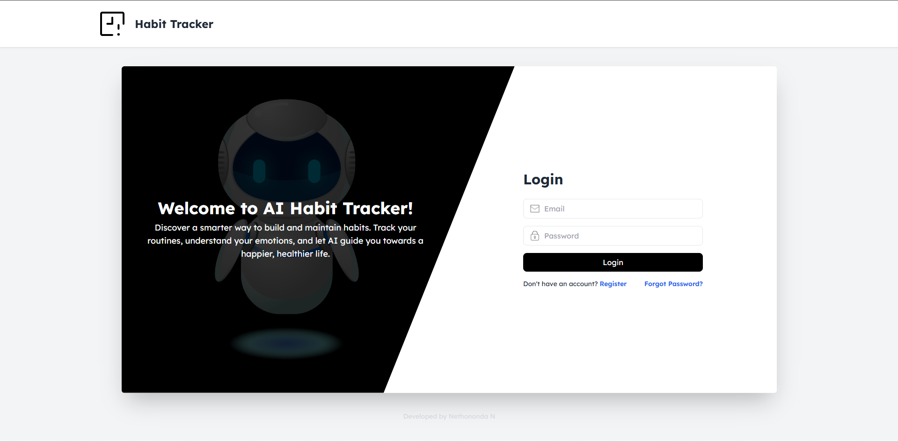
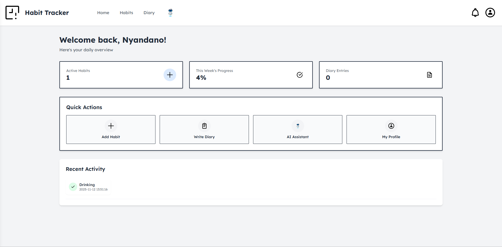
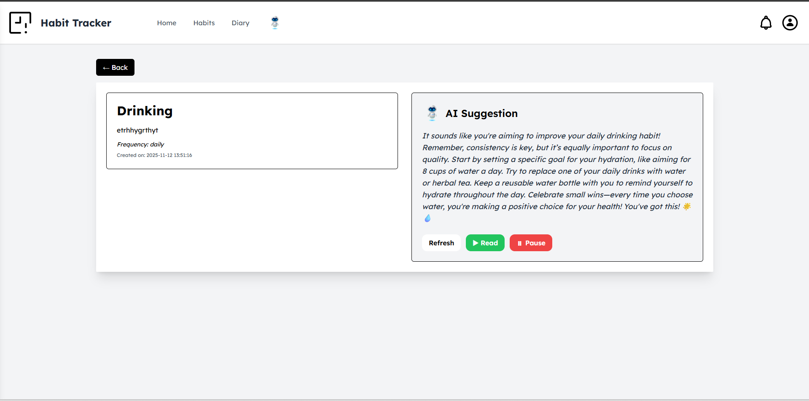

# AI-Habit Tracker


**AI-Habit Tracker** is a modern habit tracking system powered by **AI**, designed to help users track their habits, receive personalized suggestions, and gain insights into their mood and productivity.  

Users can enter their habits, interact with an AI-powered diary, and chat with an AI voice assistant with different accents. The system is built with **PHP, HTML, CSS, Tailwind CSS (CDN), JavaScript, OpenAI, and MySQL**.

---

## Badges


---

## Table of Contents

- [About the Project](#about-the-project)
- [Key Features](#key-features)
- [Technology Stack](#technology-stack)
- [Screenshots](#screenshots)
- [Live Demo](#live-demo)
- [Installation Guide](#installation-guide)
- [AI Components](#ai-components)
- [Roadmap](#roadmap)
- [Contributing](#contributing)
- [License](#license)
- [Author](#author)

---

## About the Project

**AI-Habit Tracker** allows users to:

- Track personal habits and daily routines
- Receive AI suggestions on how to improve habits
- Maintain an AI-powered diary with mood/sentiment analysis
- Visualize diary entries using colored calendar days
- Interact with an AI voice chatbot with multiple accents

This project is designed for individuals who want a smart, interactive way to improve productivity, self-awareness, and personal growth.

---

## Key Features

### Habit Tracking
- Add, edit, and view habits
- Mark habits as complete or pending
- AI suggestions for habit improvement

### AI Diary
- Write daily diary entries
- AI analyzes mood (Happy / Mid / Sad)
- Assigns color-coded days in the calendar based on sentiment
- Provides advice and reflections on diary entries

### AI Chatbot
- Voice-to-voice conversation with AI
- Multiple accent options
- Context-aware responses

### Dashboard
- Visual overview of habits and diary insights
- Color-coded calendar for mood tracking
- Easy navigation between habits, diary, and AI chat

---

## Technology Stack

| Layer        | Technology |
|-------------|------------|
| Frontend    | HTML, CSS, Tailwind CSS (CDN), JavaScript |
| Backend     | PHP 8+ |
| Database    | MySQL |
| AI          | OpenAI API (ChatGPT + Sentiment Analysis + Voice) |
| Deployment  | XAMPP / Localhost or Live Server |

---

## Screenshots


| Login | Dashboard |
|-------|-----------|
|  |  |

| Habits | Edit Habit | View Habit |
|--------|------------|------------|
|  |  |  |

| AI Chat | Diary Entry | Diary Calendar |
|---------|------------|----------------|
|  |  |  |

---

## Live Demo

Check out the live demo here:

[🔗 Live Demo](https://habit-trackers.infinityfreeapp.com/)

---

## Installation Guide

Follow these steps to install and run the project locally:

### 1. Clone the repository
```bash
git clone https://github.com/yourusername/AI-Habit-Tracker.git
cd AI-Habit-Tracker
